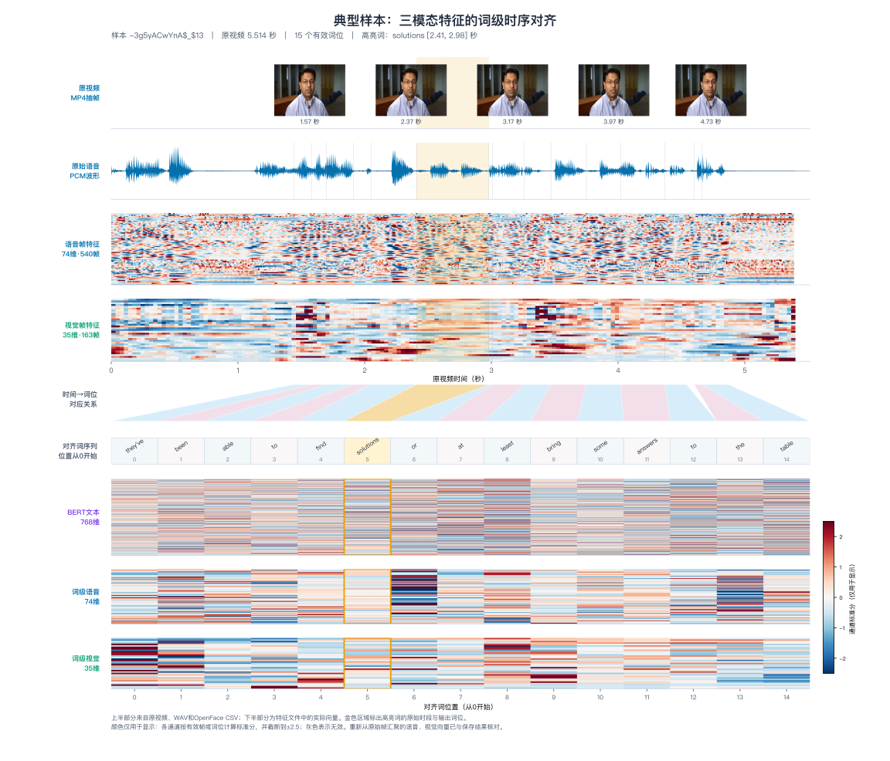

# 问题一：多模态特征提取与词级时序对齐

## 1 特征提取与时序对齐

### 1.1 数据整理与统一时间轴

附件1包含100条视频片段及对应的Excel标注。标注表中的 `video_id` 和 `clip_id` 共同确定样本身份，同一行还记录英文转写、情感回归分数和分类标签。程序先核对标注行与原始MP4的一一对应关系，再用FFmpeg将视频音轨转换为16 kHz、单声道、16位PCM语音文件。转换过程不进行降噪或响度归一化。

以原视频起点为零点，Montreal Forced Aligner（MFA）根据语音和标注转写生成词级TextGrid。程序读取其中每个非空词的起止时间 $[s_k,e_k]$，以该区间作为三模态的共同时间轴。首尾静音不构成词位，因此首词至末词的时间范围可能短于原视频时长。

### 1.2 三模态特征定义

文本特征由冻结的 `bert-base-uncased` 提取。模型将词拆分为WordPiece，输出末层768维隐状态；属于同一个原词的子词向量取算术均值，得到一个词向量。特征提取期间不利用情感标签更新模型参数。

语音特征由 `librosa` 提取，帧移为160个采样点，即10 ms。每帧74维描述符包含基频、浊音概率、能量、过零率、起音强度、20维MFCC及其一阶和二阶差分，以及频谱、谐噪比和局部基频扰动等指标。多数短时特征使用400点分析窗，即25 ms；基频估计使用1024点分析帧。该描述符覆盖所需的主要声学类别，不等同于某个历史COVAREP程序的逐位输出。

视觉特征由OpenFace `FeatureExtraction` 从原MP4提取。每帧35维，包括17维面部动作单元强度、6维头部姿态、8维眼睛及注视方向，以及由68个面部关键点计算的4维面部几何统计量。OpenFace CSV中的 `timestamp` 提供视频帧时间；`success` 和 `confidence` 用于判断帧是否可用。

**表1 三模态特征定义与质量覆盖**

| 模态 | 模型与提取方法 | 词级特征维度 | 正常词位 | 异常词位 | 样本覆盖情况 |
| --- | --- | ---: | ---: | ---: | --- |
| 文本 | 冻结的 `bert-base-uncased`；同词WordPiece向量取均值 | 768 | 1,917（100%） | 0（0%） | 100条均有文本特征 |
| 语音 | `librosa` 与 `pYIN`；提取基频、能量、MFCC及差分、频谱等特征 | 74 | 1,893（98.75%） | 24（1.25%） | 98条完整；2条数字静音，语音全程不可用 |
| 视觉 | OpenFace；提取动作单元、头姿、注视及面部几何特征 | 35 | 1,825（95.20%） | 92（4.80%） | 87条完整、9条部分异常、4条完全缺失 |

注：各模态均以1,917个真实词位为分母，右侧填充位不参与统计。“正常”表示该词位的模态质量掩码为真；“异常”表示模态不可用或未达到质量阈值。视觉的92个异常词位中，90个不可用，2个未达到质量阈值。这里没有按特征幅度识别或删除统计离群值。

### 1.3 跨模态时间对应与定长表示

文本向量按词排列，语音和视觉特征则需要从帧映射到词。程序根据相邻帧中心的中点确定帧覆盖区间 $[l_j,r_j]$。对词 $k$ 与帧 $j$，以时间重叠长度和帧质量 $q_j$ 的乘积作为权重：

$$
w_{kj}=\left|[s_k,e_k]\cap[l_j,r_j]\right|q_j.
$$

当有效权重之和大于零时，词级语音或视觉向量为

$$
\mathbf{x}_k=\frac{\sum_j w_{kj}\mathbf{f}_j}{\sum_j w_{kj}}.
$$

覆盖时间较长且质量较高的帧对该词贡献较大。若某个词没有有效语音帧或视觉帧，程序将相应模态向量设为零，同时将可用性掩码设为假。这样，零向量不会被误读为真实的声学或面部观测。

每条样本最终保存50个时间位置。原词数不超过50时，程序保持原词顺序，在右侧补零；超过50时，将全部词按原顺序划分为50个连续组，再依据词时长、模态质量和可用性加权汇聚。样本 `-a55Q6RWvTA$_$3` 原有65个词，按此规则聚合为50位，没有截断视频后段。每个输出位置都保存原词索引范围 `source_word_span`，可回查转写及原始时间区间。

上述步骤对每条样本按同一规则执行。为明确异常判断、词级汇聚和定长处理的先后顺序，算法1列出从原始视频到特征文件的完整流程。

**算法1 三模态特征提取与词级时序对齐**

**输入：** 附件1的标注表 $\mathcal D$ 与原始视频集合 $\mathcal V$；目标序列长度 $L=50$；人脸置信度阈值 $\tau_f=0.50$；视觉插值时间上限 $\tau_g=0.25\,\mathrm{s}$；词位质量阈值 $\tau_q=0.25$。

**输出：** 文本、语音和视觉特征张量，词区间、有效长度、可用性与质量掩码，以及逐样本审计记录。

```text
1  读取标注表，以 video_id 和 clip_id 定位每条样本的 MP4。
2  for 每条视频样本 i = 1, 2, …, 100 do
3      从 MP4 提取 16 kHz 单声道 PCM 语音，读取视频时长。
4      用语音和转写运行 MFA，生成词级 TextGrid。
5      if TextGrid 不存在 then
6          若音轨为全零数字静音，则把转写词均匀分配到视频全长，
           标记回退方法，并将对齐置信代理值设为 0；否则报错。
7      end if
8      读取词序列及其时间区间 [sₖ, eₖ]，k = 1, …, nᵢ。
9      使用冻结 BERT 提取词向量；同词 WordPiece 向量取均值。
10     按 10 ms 帧移提取 74 维语音帧特征；静音帧和非有限值帧的质量设为 0。
11     使用 OpenFace 提取 35 维视觉帧特征；检测失败或置信度
       低于 0.50 的帧设为无效；对满足条件的短缺口进行低权重插值。
12     for 每个词区间 [sₖ, eₖ] do
13         计算词区间与语音、视觉帧覆盖区间的重叠时长。
14         按“重叠时长 × 帧质量”分别汇聚语音和视觉特征。
15         若某模态没有有效帧，则填零并标记该模态不可用。
16     end for
17     if 原词数 nᵢ > 50 then
18         将全部词按原顺序划分为 50 个连续组，按词时长、质量和
           可用性汇聚组内特征。
19     else
20         保持原词顺序，在右侧补零至 50 个位置。
21     end if
22     保存词区间、原词索引范围、有效长度和模态可用性掩码；
       根据质量分数是否达到 0.25 生成质量掩码。
23 end for
24 按标注表顺序堆叠100条样本，核查来源、时间轴、填充位和非有限值。
25 写入特征文件、来源清单和审计记录。
```

按算法1处理后，100条样本具有一致的序列长度和明确的质量标记。图1给出每个有效位置的特征维度，并统计这批样本的原始情感标签分布。


**图1 三模态特征维度与情感标签分布。** 图1(a)中的柱长是每个有效词位的向量维度，分别为文本768维、语音74维和视觉35维，不能解释为模态重要性。图1(b)按视频统计分类标签：正向57条、中性25条、负向18条。图1(c)保留回归标签的原始离散取值：0分有25条，0.333分有19条，0.667分有17条，取值范围为−2至2.667。这两种标签分布均来自原始标注，不是模型预测结果。

## 2 特征文件规范与结果汇总

### 2.1 文件格式、组织结构与读取

原始特征保存在 [`problem1_features.pkl`](../outputs/problem1_features.pkl)，采用Python pickle格式。顶层字段 `metadata` 记录维度、工具版本和运行参数；`samples` 保存逐样本的转写、标签、原词时间轴、来源文件及质量诊断；`stacked` 将100条样本整理为可直接读取的批量数组。

三个核心数组的形状为

$$
\mathrm{text}:(100,50,768),\qquad
\mathrm{audio}:(100,50,74),\qquad
\mathrm{vision}:(100,50,35).
$$

文件还保存 `intervals`、`valid_length`、`valid_mask`、`padding_mask`、`modality_availability_mask`、`quality_scores` 和 `quality_mask`。掩码中的模态顺序固定为文本、语音、视觉。`padding_mask=True` 表示该位置为填充位，后续计算应忽略。读取单条样本有效词位的代码如下：

```python
import pickle

with open("outputs/problem1_features.pkl", "rb") as file:
    data = pickle.load(file)

sample_index = 0
length = int(data["stacked"]["valid_length"][sample_index])
text = data["stacked"]["text"][sample_index, :length]
audio = data["stacked"]["audio"][sample_index, :length]
vision = data["stacked"]["vision"][sample_index, :length]
intervals = data["stacked"]["intervals"][sample_index, :length]
```

上述四个数组的第一维相同，第 $k$ 行对应同一输出词位。这里的“标准化时序特征”指统一时间索引和固定序列长度，并不表示对最终特征值做了全局Z分数标准化。

### 2.2 代表性样本与全量附件

表2列出常规对齐、长转写、数字静音及时间轴回退的代表性结果。原视频时长指MP4片段长度。“可用词位”按文本、语音、视觉顺序记录。样本编号从1开始，pickle中的行索引从0开始。

**表2 问题一特征提取结果示例**

| 样本编号 | 样本ID | 原视频时长/s | 输出有效长度 | 模态类型与维度 | 文本/语音/视觉可用词位 | 对齐粒度与方式 |
| ---: | --- | ---: | ---: | --- | --- | --- |
| 1 | `-3g5yACwYnA$_$13` | 5.514 | 15 | 文本768、语音74、视觉35 | 15/15/15 | 词级，MFA |
| 19 | `-a55Q6RWvTA$_$3` | 22.154 | 50 | 文本768、语音74、视觉35 | 50/50/50 | 连续词组，MFA |
| 42 | `-mJ2ud6oKI8$_$1` | 6.103 | 13 | 文本768、语音74、视觉35 | 13/0/0 | 词级，MFA；语音和视觉不可用 |
| 43 | `-mJ2ud6oKI8$_$2` | 5.731 | 11 | 文本768、语音74、视觉35 | 11/0/7 | 均匀词区间回退 |

样本19原有65个词，经过连续分组得到50个有效位置。样本42虽有MFA TextGrid，但音轨为数字静音，13个语音词位均不可用。样本43也是数字静音，且没有TextGrid，因此使用覆盖整个视频时长的均匀词区间。这些区间只用于保留可追溯的序列位置，不能视为经过声学验证的词边界。

附件中的 [`full_results.csv`](full_results.csv) 对100条样本按三模态分别展开，共300行，包含样本编号、原视频时长、对齐范围、有效长度、模态维度、可用词位和来源路径。[`problem1_features.manifest.csv`](../outputs/problem1_features.manifest.csv) 进一步记录Excel行号、原视频及中间文件路径、文件哈希、原词数和对齐方式。原始特征pickle随附件提交，表2用于展示字段和特殊样本的处理结果。

## 3 异常数据与质量检查

### 3.1 异常处理规则

语音帧的RMS不大于 $10^{-6}$，或帧特征含非有限值时，该帧质量权重设为零。若某个词没有可用语音帧，程序保存零向量，并标记语音不可用。视觉帧须通过OpenFace的 `success` 判断，且 `confidence` 不低于0.50。短时检测缺口只有在前后均存在有效帧、两端有效帧的时间跨度不超过0.25 s时才线性插值；插值帧的质量权重低于原始有效帧。长缺口和视频边界缺口保持缺失。

词级质量分数低于0.25时，`quality_mask` 为假。可用性掩码表示是否取得观测，质量掩码表示该观测是否达到阈值，两者含义不同。本研究保留全部100条样本，没有依据IQR、Z分数或标签极值删除样本。两条数字静音样本的24个语音词位构成全部语音异常位置。

若MFA未生成TextGrid，程序先核查语音是否为全零数字静音。只有满足该条件才使用均匀词区间，并记录回退方法及零对齐置信代理值；非静音样本缺少TextGrid会报错。样本42的TextGrid已存在，因而没有启用回退。它的词序一致率为1仅表示TextGrid词序与转写相符，不能说明静音音轨具有可靠的声学边界。

### 3.2 全量质量结果

100条样本共有1,917个真实词位和3,083个右侧填充位。以真实词位为分母，文本正常率为100%，语音为98.75%，视觉为95.20%。以视频为分母，视觉有87条完整、9条部分异常和4条全缺。输出特征均通过非有限值检查。


**图2 三模态数据质量覆盖。** 上半部分以每个模态的1,917个真实词位为分母，蓝色为质量合格位置，橙色为不可用位置，黄色为未过质量阈值的位置；视觉异常包含90个不可用位置和2个低质量位置。下半部分以100条视频为分母，比较完整、部分异常和全缺的样本数。图中的“异常”由可用性和质量掩码定义，不表示按特征幅度检测了统计离群点。


**图3 样本间质量诊断相似度矩阵。** 令 $\mathbf q_i$ 表示样本 $i$ 的词序匹配、语音有效覆盖、视觉有效覆盖和音视频时长一致度四项诊断值，矩阵元素定义为

$$
S(i,j)=1-\frac{1}{4}\sum_{m=1}^{4}|q_{im}-q_{jm}|.
$$

非对角线相似度的中位数约为0.99665，多数样本的四项诊断值较接近。索引41和42形成明显的横竖条带，反映数字静音及相关视觉缺失。该矩阵比较的是样本的数据质量画像，不是三模态特征向量或情感内容的相似性。

## 4 典型样本的时序验证

### 4.1 文本、语音与视频帧的逐词对应

选取样本1 `-3g5yACwYnA$_$13`，其英文转写为：

> They've been able to find solutions or at least bring some answers to the table.

该视频长5.514 s，共形成15个有效词位，三模态在全部词位均可用。表3摘录四个词。语音和视频帧列给出与词区间存在时间交叠的候选帧中心范围，实际词向量仍按重叠长度和帧质量加权。

**表3 典型样本的词位与三模态特征对应关系**

| 输出位置 | 词 | 词区间/s | 语音候选帧中心 | 视频候选帧中心 | 文本向量范数 | 语音 `log-RMS` | 视觉 `AU12_r` |
| ---: | --- | --- | --- | --- | ---: | ---: | ---: |
| 0 | they've | 1.440～1.580 | 1.440～1.580，15帧 | 1.433～1.567，5帧 | 9.538 | −4.562 | 0.331 |
| 4 | find | 2.050～2.410 | 2.050～2.410，37帧 | 2.033～2.400，12帧 | 12.948 | −5.693 | 0.520 |
| 5 | solutions | 2.410～2.980 | 2.410～2.980，58帧 | 2.400～2.967，18帧 | 12.803 | −5.521 | 0.492 |
| 14 | table | 4.660～4.870 | 4.660～4.870，22帧 | 4.667～4.867，7帧 | 13.377 | −5.186 | 0.213 |

### 4.2 时序图核验



**图4 典型样本的三模态词级时序对齐。** 上半部分将原视频截图、PCM波形、语音帧特征和视觉帧特征置于同一秒级时间轴；中部连接原始时间区间与词序列位置；下半部分展示pickle文件中实际保存的768维文本、74维语音和35维视觉词级向量。高亮词 `solutions` 的原始区间为2.41～2.98 s，对应输出位置5。语音与视频的采样频率不同，但最终均汇聚到这个词位。

图4中的热图颜色按特征通道在显示范围内计算标准分数，并截断到±2.5，仅用于显示，不改变保存的特征数值。重新从原始帧计算的语音、视觉词向量与保存结果的最大绝对差分别约为 $1.22\times10^{-4}$ 和 $6.10\times10^{-5}$。全部15个词位的对应数据见 [`typical_alignment.csv`](typical_alignment.csv)，图像来源与核验信息见 [`typical_alignment.provenance.json`](typical_alignment.provenance.json)。

## 5 方案可复现性

### 5.1 工具版本与核心参数

本次生成结果时记录的主要版本为Python 3.11.16、FFmpeg 8.1.2、MFA 3.4.2、PyTorch 2.13.0、Transformers 5.17.0和librosa 0.11.0。文本模型为本地冻结的 `bert-base-uncased`；MFA使用 `english_us_arpa` 词典和同名声学模型；视觉特征由OpenFace `FeatureExtraction` 提取。OpenFace命令未提供可靠版本号，因此审计文件记录了可执行文件、模型和提取源码的SHA-256指纹。

核心参数为语音采样率16 kHz、帧移160点、主要声学帧长400点、基频分析帧长1024点、人脸置信度下限0.50、视觉短缺口上限0.25 s、词位质量阈值0.25、目标序列长度50和CPU推理。

### 5.2 运行与独立核验

从原始素材复现时，先按 [`requirement.md`](../requirement.md) 准备环境和模型，再在 `problem1` 目录运行下列命令。重新提取应使用独立工作目录，并添加 `--no-resume --clean-mfa`，以免沿用既有中间文件。

```bash
problem1 run \
  --labels '../E题数据/附件1-数据集原始多模态样本/MOSEI数据集部分原始视频-100条/label-100.xlsx' \
  --videos-root '../E题数据/附件1-数据集原始多模态样本/MOSEI数据集部分原始视频-100条' \
  --work-dir work_reproduce \
  --output outputs/problem1_features_reproduce.pkl \
  --bert-model models/bert-base-uncased \
  --mfa-dictionary english_us_arpa \
  --mfa-acoustic-model english_us_arpa \
  --openface models/openface/FeatureExtraction \
  --openface-model models/openface/model/main_clnf_general.txt \
  --device cpu \
  --target-length 50 \
  --visual-interpolation-gap 0.25 \
  --quality-threshold 0.25 \
  --no-resume --clean-mfa
```

生成后，可对相同的输入和工作目录运行审计命令；核查过程包含标注与视频覆盖、中间文件、词级时间轴、填充位、特征数值及来源哈希。

```bash
problem1 audit \
  --features outputs/problem1_features_reproduce.pkl \
  --labels '../E题数据/附件1-数据集原始多模态样本/MOSEI数据集部分原始视频-100条/label-100.xlsx' \
  --videos-root '../E题数据/附件1-数据集原始多模态样本/MOSEI数据集部分原始视频-100条' \
  --work-dir work_reproduce \
  --verify-only
```

已提交结果的独立审计确认，100条标签、100条原视频与100条输出特征一一对应；99条样本具有MFA TextGrid，1条数字静音样本使用回退；全部特征值均为有限值。逐文件哈希在审计阶段采集，首次提取运行时尚未记录这些哈希。具体参数、来源及检查结果见 [`problem1_features.reproduce.md`](../outputs/problem1_features.reproduce.md) 和 [`problem1_features.audit.json`](../outputs/problem1_features.audit.json)。

## 图表放置索引

| 子章节 | 图表 | 作用 |
| --- | --- | --- |
| 1.2 三模态特征定义 | 表1 | 汇总提取方法、维度和质量覆盖 |
| 1.3 跨模态时间对应 | 算法1、图1 | 给出可执行流程，随后展示特征维度与原始标签分布 |
| 2.2 代表性样本与全量附件 | 表2 | 展示常规、长转写、静音和回退样本 |
| 3.2 全量质量结果 | 图2 | 展示模态质量覆盖 |
| 3.2 末尾或附录 | 图3 | 展示四项诊断组成的样本间相似度 |
| 4.1 逐词对应 | 表3 | 给出可逐位核查的时间与特征数值 |
| 4.2 时序图核验 | 图4 | 展示原视频、波形、帧特征与词向量的完整对应 |

## 附录：其他图像的使用说明

[`problem1_feature_label_distribution.svg`](../outputs/problem1_feature_label_distribution.svg) 与图1使用相同的数据，只是横向版式不同，正文保留图1即可。


[`sample_000_timeline.svg`](../outputs/sample_000_timeline.svg) 与图4使用同一典型样本，展示词区间、逐词 `log-RMS`、视频截图及三模态向量范数。其颜色在各模态内部缩放，不能跨行比较绝对大小；如需精简正文，可仅保留图4。


[`smoke_timeline.svg`](../outputs/smoke_timeline.svg) 是初期流程验证图。它以不同模态的原始特征范数共用颜色尺度，语音数值幅度占主导，文本行显得较暗，这不表示文本缺失。该图适合留作开发检查记录，不作为正文中的定量证据。


`models/OpenFace-partial` 目录中的 `appearance.png`、`au_sample.png`、`gaze_ex.png`、`landmark_scheme_68.png` 和 `multi_face_img.png` 是OpenFace源码附带的外观、动作单元、注视及关键点示例；`logo1.png`、`muticomp_logo_black.png` 和 `muticomp_logo_white.png` 为软件或机构标识。这八张图均不来自附件1的100条视频，不应作为问题一的实验结果图。
