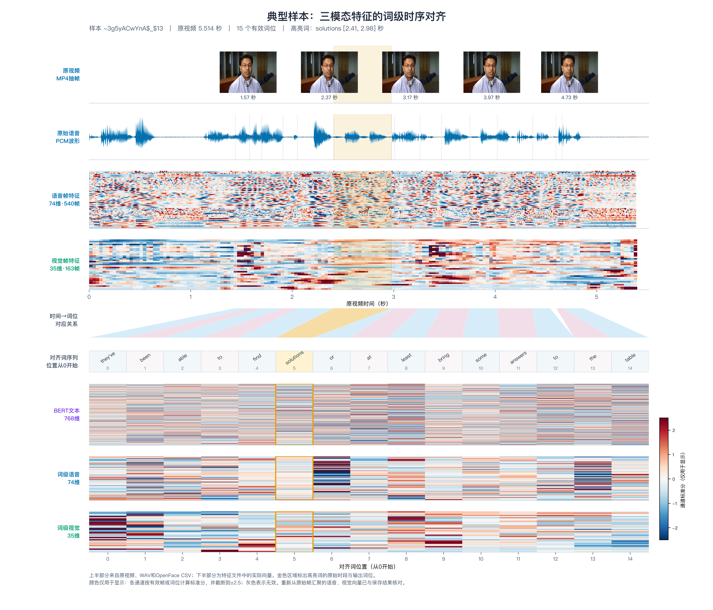

# 问题1：特征提取、时序对齐与全量结果

## 1. 数据与处理流程

附件1的100条视频以Excel标签表中的 `video_id`、`clip_id` 确定样本ID。每条记录按以下流程处理：

`标签行 + MP4 → 16 kHz单声道WAV及转写LAB → MFA词级TextGrid → BERT文本特征 / librosa语音帧特征 / OpenFace视频帧特征 → 词区间质量加权池化 → 长序列连续聚合或右侧零填充 → 50位三模态特征及掩码 → 全量审计`。

原视频时长为 2.257–29.288 秒（中位数 6.722 秒）；对齐后有效序列长度为 5–50 位（中位数 18 位）。全部100条均保留，1条超过50词并按连续词组聚合。99条使用MFA对齐；1条数字静音、没有TextGrid的样本使用全时长均匀词区间，`alignment_confidence=0`，其他缺失TextGrid的样本会报错。4条样本未检测到有效人脸，视觉可用性由掩码标记。

### 1.1 特征定义与工具

| 模态 | 原始来源 | 工具与提取方法 | 每个对齐位置的维度 |
| --- | --- | --- | ---: |
| 文本 | Excel转写及MFA词序列 | 本地冻结的 `bert-base-uncased`；快速分词器将WordPiece映射回词，对同词子词的末层向量取算术均值 | 768 |
| 语音 | MP4音轨提取的16 kHz单声道PCM WAV | FFmpeg提取音频；`librosa` 以10 ms帧移生成74维描述符，多数短时谱特征使用25 ms窗，pYIN基频使用1024点分析帧：F0、浊音概率、log-RMS、RMS、过零率、起音强度共6维；20维MFCC及一、二阶差分共60维；频谱与谐噪/局部jitter共8维 | 74 |
| 视觉 | 原MP4视频帧 | OpenFace `FeatureExtraction`：17维AU强度、6维头姿、8维眼睛注视、4维68点面部几何统计；人脸检测 `success` 无效或置信度低于0.50的帧无效，短于等于0.25秒且两端有效的缺口做线性插值 | 35 |

74维语音描述符覆盖题目要求的声学类别，**不宣称与特定历史COVAREP二进制逐位相同**。视觉缺失没有被伪造为有效人脸特征。

### 1.2 时序对齐规则

MFA的非空词区间 `[s_k,e_k]` 是统一时间轴，单位为相对原视频起点的秒。语音帧中心由10 ms帧移产生，视觉帧中心取OpenFace CSV的 `timestamp`；相邻中心的中点界定帧覆盖区间。对词 `k` 与模态帧 `j`，权重为 `w(k,j)=|[s_k,e_k]∩[l_j,r_j]| × q_j`，其中 `q_j` 为帧质量。词级语音或视觉向量是所有有效帧按该权重的平均；没有有效帧时向量为零，并将模态可用掩码置为假。文本向量直接映射到相同词位。音频静音帧质量为零；视觉帧质量采用OpenFace置信度，并只对有界短缺口插值。

原词数不超过50时按词顺序排布，后续位置右侧零填充；超过50词时用连续分组覆盖全部词，并按词时长、质量及可用性再次加权汇聚。`source_word_span` 保存每个输出位置在原词序列中的半开索引范围，填充位置为 `[-1,-1]`；`valid_length`、`valid_mask`、`padding_mask` 和三模态质量/可用掩码同时保存。对齐粒度因此为词，唯一长样本为连续词组。

## 2. 特征文件规范与全量结果

原始特征文件为 `problem1_features.pkl`，使用Python pickle存储字典。`metadata` 包含格式版本、工具版本、参数、特征名和审计信息；`samples` 是按Excel标签顺序排列的100条逐样本记录；`stacked` 是直接建模的批量数组。核心数组形状为 `text=(100,50,768)`、`audio=(100,50,74)`、`vision=(100,50,35)`、`intervals=(100,50,2)`，三模态顺序固定为文本/语音/视觉。`stacked['id'][i]`、`samples[i]['id']` 与清单第 `i` 行一致。读取示例：

```python
import pickle
with open("problem1_features.pkl", "rb") as file:
    data = pickle.load(file)
i = 0
sample_id = data["stacked"]["id"][i]
length = int(data["stacked"]["valid_length"][i])
text = data["stacked"]["text"][i, :length]       # (length, 768)
audio = data["stacked"]["audio"][i, :length]     # (length, 74)
vision = data["stacked"]["vision"][i, :length]   # (length, 35)
intervals = data["stacked"]["intervals"][i, :length]
```

下表的“原视频有效时长”指原MP4片段长度；“词轴范围”指首个至末个有效对齐词的时段，两者因首尾静音可不同。“可用位”依次为文本/语音/视觉，维度亦依此顺序。序号为1–100，pickle行索引为序号减1。每个模态分别展开的300行机器可读表见 `full_results.csv`，其中还记录Excel行号、源路径、特征SHA-256。

| 序号 | 样本ID | 原视频有效时长(s) | 词轴范围(s) | 有效位 | T/A/V可用位 | T/A/V维度 | 粒度 | 来源 |
| ---: | --- | ---: | --- | ---: | --- | --- | --- | --- |
| 1 | -3g5yACwYnA$_$13 | 5.514 | 1.440–4.870 | 15 | 15/15/15 | 768/74/35 | 词 | MFA |
| 2 | -3g5yACwYnA$_$3 | 14.389 | 0.520–14.300 | 29 | 29/29/29 | 768/74/35 | 词 | MFA |
| 3 | -3g5yACwYnA$_$2 | 9.394 | 0.220–9.170 | 14 | 14/14/14 | 768/74/35 | 词 | MFA |
| 4 | -3g5yACwYnA$_$9 | 8.817 | 0.750–8.130 | 23 | 23/23/23 | 768/74/35 | 词 | MFA |
| 5 | -3nNcZdcdvU$_$5 | 7.868 | 0.490–7.230 | 18 | 18/18/18 | 768/74/35 | 词 | MFA |
| 6 | -HwX2H8Z4hY$_$2 | 3.982 | 0.000–3.420 | 5 | 5/5/2 | 768/74/35 | 词 | MFA |
| 7 | -HwX2H8Z4hY$_$5 | 5.653 | 0.750–5.100 | 9 | 9/9/2 | 768/74/35 | 词 | MFA |
| 8 | -HwX2H8Z4hY$_$6 | 3.358 | 0.540–2.780 | 7 | 7/7/5 | 768/74/35 | 词 | MFA |
| 9 | -HwX2H8Z4hY$_$9 | 7.734 | 0.510–7.636 | 22 | 22/22/22 | 768/74/35 | 词 | MFA |
| 10 | -NFrJFQijFE$_$1 | 5.746 | 0.100–5.659 | 16 | 16/16/0 | 768/74/35 | 词 | MFA |
| 11 | -NFrJFQijFE$_$2 | 6.856 | 0.000–6.698 | 18 | 18/18/0 | 768/74/35 | 词 | MFA |
| 12 | -THoVjtIkeU$_$12 | 14.896 | 1.580–14.290 | 39 | 39/39/39 | 768/74/35 | 词 | MFA |
| 13 | -THoVjtIkeU$_$2 | 4.292 | 0.030–3.720 | 10 | 10/10/10 | 768/74/35 | 词 | MFA |
| 14 | -THoVjtIkeU$_$6 | 8.097 | 0.480–7.600 | 30 | 30/30/30 | 768/74/35 | 词 | MFA |
| 15 | -UuX1xuaiiE$_$1 | 10.350 | 0.000–9.780 | 27 | 27/27/27 | 768/74/35 | 词 | MFA |
| 16 | -UuX1xuaiiE$_$0 | 3.633 | 0.000–3.360 | 9 | 9/9/9 | 768/74/35 | 词 | MFA |
| 17 | -UuX1xuaiiE$_$3 | 4.130 | 0.000–3.690 | 9 | 9/9/9 | 768/74/35 | 词 | MFA |
| 18 | -UuX1xuaiiE$_$6 | 8.114 | 0.540–7.420 | 22 | 22/22/22 | 768/74/35 | 词 | MFA |
| 19 | -a55Q6RWvTA$_$3 | 22.154 | 0.520–21.610 | 50 | 50/50/50 | 768/74/35 | 连续词组 | MFA |
| 20 | -aNfi7CP8vM$_$7 | 8.695 | 0.500–8.000 | 18 | 18/18/18 | 768/74/35 | 词 | MFA |
| 21 | -aqamKhZ1Ec$_$0 | 10.967 | 0.040–10.380 | 14 | 14/14/14 | 768/74/35 | 词 | MFA |
| 22 | -dxfTGcXJoc$_$1 | 16.161 | 0.490–15.520 | 36 | 36/36/36 | 768/74/35 | 词 | MFA |
| 23 | -dxfTGcXJoc$_$0 | 20.500 | 0.560–19.890 | 42 | 42/42/34 | 768/74/35 | 词 | MFA |
| 24 | -dxfTGcXJoc$_$2 | 16.698 | 0.510–16.110 | 35 | 35/35/35 | 768/74/35 | 词 | MFA |
| 25 | -dxfTGcXJoc$_$6 | 12.735 | 0.410–12.120 | 28 | 28/28/28 | 768/74/35 | 词 | MFA |
| 26 | -egA8-b7-3M$_$26 | 6.031 | 0.510–5.380 | 15 | 15/15/15 | 768/74/35 | 词 | MFA |
| 27 | -egA8-b7-3M$_$17 | 7.271 | 0.510–6.580 | 16 | 16/16/16 | 768/74/35 | 词 | MFA |
| 28 | -egA8-b7-3M$_$18 | 8.386 | 0.510–7.810 | 22 | 22/22/22 | 768/74/35 | 词 | MFA |
| 29 | -egA8-b7-3M$_$16 | 5.538 | 0.370–5.010 | 11 | 11/11/11 | 768/74/35 | 词 | MFA |
| 30 | -egA8-b7-3M$_$13 | 4.184 | 0.510–3.560 | 11 | 11/11/11 | 768/74/35 | 词 | MFA |
| 31 | -egA8-b7-3M$_$1 | 10.266 | 0.000–9.710 | 20 | 20/20/20 | 768/74/35 | 词 | MFA |
| 32 | -egA8-b7-3M$_$6 | 6.265 | 0.480–5.650 | 12 | 12/12/12 | 768/74/35 | 词 | MFA |
| 33 | -egA8-b7-3M$_$9 | 5.090 | 0.450–4.440 | 10 | 10/10/10 | 768/74/35 | 词 | MFA |
| 34 | -egA8-b7-3M$_$20 | 6.645 | 0.490–5.970 | 20 | 20/20/20 | 768/74/35 | 词 | MFA |
| 35 | -iRBcNs9oI8$_$3 | 5.621 | 0.570–5.440 | 8 | 8/8/8 | 768/74/35 | 词 | MFA |
| 36 | -iRBcNs9oI8$_$7 | 4.104 | 0.000–3.980 | 9 | 9/9/9 | 768/74/35 | 词 | MFA |
| 37 | -iRBcNs9oI8$_$6 | 2.903 | 0.000–2.170 | 5 | 5/5/5 | 768/74/35 | 词 | MFA |
| 38 | -iRBcNs9oI8$_$9 | 3.416 | 1.280–2.820 | 5 | 5/5/5 | 768/74/35 | 词 | MFA |
| 39 | -iRBcNs9oI8$_$8 | 8.093 | 0.000–8.026 | 21 | 21/21/21 | 768/74/35 | 词 | MFA |
| 40 | -lzEya4AM_4$_$5 | 7.675 | 0.480–7.170 | 19 | 19/19/19 | 768/74/35 | 词 | MFA |
| 41 | -lzEya4AM_4$_$6 | 14.792 | 0.520–14.310 | 43 | 43/43/43 | 768/74/35 | 词 | MFA |
| 42 | -mJ2ud6oKI8$_$1 | 6.103 | 0.000–2.710 | 13 | 13/0/0 | 768/74/35 | 词 | MFA |
| 43 | -mJ2ud6oKI8$_$2 | 5.731 | 0.000–5.731 | 11 | 11/0/7 | 768/74/35 | 词 | 静音回退 |
| 44 | -mJ2ud6oKI8$_$6 | 2.257 | 0.000–2.200 | 5 | 5/5/5 | 768/74/35 | 词 | MFA |
| 45 | -mJ2ud6oKI8$_$9 | 7.033 | 0.000–6.909 | 22 | 22/22/22 | 768/74/35 | 词 | MFA |
| 46 | -mJ2ud6oKI8$_$8 | 4.192 | 0.770–3.960 | 11 | 11/11/11 | 768/74/35 | 词 | MFA |
| 47 | -mqbVkbCndg$_$0 | 6.467 | 0.050–5.970 | 14 | 14/14/14 | 768/74/35 | 词 | MFA |
| 48 | -t217m2on-s$_$2 | 5.686 | 0.510–5.050 | 12 | 12/12/12 | 768/74/35 | 词 | MFA |
| 49 | -t217m2on-s$_$7 | 17.183 | 0.520–16.480 | 45 | 45/45/45 | 768/74/35 | 词 | MFA |
| 50 | -tANM6ETl_M$_$3 | 6.758 | 0.510–6.090 | 22 | 22/22/22 | 768/74/35 | 词 | MFA |
| 51 | -tPCytz4rww$_$11 | 5.467 | 0.000–5.310 | 17 | 17/17/17 | 768/74/35 | 词 | MFA |
| 52 | -tPCytz4rww$_$10 | 4.789 | 0.500–4.150 | 12 | 12/12/12 | 768/74/35 | 词 | MFA |
| 53 | -tPCytz4rww$_$12 | 11.864 | 0.330–11.200 | 26 | 26/26/26 | 768/74/35 | 词 | MFA |
| 54 | -tPCytz4rww$_$16 | 7.206 | 0.500–6.580 | 16 | 16/16/16 | 768/74/35 | 词 | MFA |
| 55 | -tPCytz4rww$_$18 | 6.645 | 0.510–6.000 | 16 | 16/16/16 | 768/74/35 | 词 | MFA |
| 56 | -vxjVxOeScU$_$4 | 9.127 | 0.000–8.930 | 21 | 21/21/21 | 768/74/35 | 词 | MFA |
| 57 | -wMB_hJL-3o$_$7 | 6.044 | 0.500–5.440 | 22 | 22/22/22 | 768/74/35 | 词 | MFA |
| 58 | -wny0OAz3g8$_$1 | 6.844 | 0.240–6.300 | 22 | 22/22/22 | 768/74/35 | 词 | MFA |
| 59 | -wny0OAz3g8$_$0 | 3.333 | 0.280–2.990 | 9 | 9/9/9 | 768/74/35 | 词 | MFA |
| 60 | -wny0OAz3g8$_$3 | 6.146 | 0.000–6.030 | 20 | 20/20/20 | 768/74/35 | 词 | MFA |
| 61 | -wny0OAz3g8$_$2 | 6.687 | 0.520–6.040 | 23 | 23/23/23 | 768/74/35 | 词 | MFA |
| 62 | -wny0OAz3g8$_$5 | 6.912 | 0.000–6.741 | 20 | 20/20/20 | 768/74/35 | 词 | MFA |
| 63 | -wny0OAz3g8$_$7 | 8.068 | 0.500–7.540 | 29 | 29/29/29 | 768/74/35 | 词 | MFA |
| 64 | -wny0OAz3g8$_$9 | 6.213 | 0.510–5.550 | 20 | 20/20/20 | 768/74/35 | 词 | MFA |
| 65 | -571d8cVauQ$_$0 | 5.067 | 1.080–4.510 | 12 | 12/12/12 | 768/74/35 | 词 | MFA |
| 66 | -571d8cVauQ$_$5 | 15.273 | 0.500–14.570 | 43 | 43/43/43 | 768/74/35 | 词 | MFA |
| 67 | -I_e4mIh0yE$_$1 | 7.622 | 0.760–6.920 | 18 | 18/18/18 | 768/74/35 | 词 | MFA |
| 68 | -I_e4mIh0yE$_$3 | 9.163 | 0.520–8.470 | 22 | 22/22/22 | 768/74/35 | 词 | MFA |
| 69 | -UacrmKiTn4$_$10 | 7.362 | 0.490–6.720 | 18 | 18/18/18 | 768/74/35 | 词 | MFA |
| 70 | -UacrmKiTn4$_$4 | 4.741 | 0.500–4.190 | 14 | 14/14/14 | 768/74/35 | 词 | MFA |
| 71 | -hnBHBN8p5A$_$7 | 7.372 | 0.000–6.210 | 13 | 13/13/12 | 768/74/35 | 词 | MFA |
| 72 | -hnBHBN8p5A$_$6 | 6.401 | 0.370–6.300 | 13 | 13/13/13 | 768/74/35 | 词 | MFA |
| 73 | -qDkUB0GgYY$_$6 | 4.678 | 0.500–4.090 | 16 | 16/16/16 | 768/74/35 | 词 | MFA |
| 74 | -uywlfIYOS8$_$4 | 6.045 | 0.000–5.380 | 18 | 18/18/18 | 768/74/35 | 词 | MFA |
| 75 | -6rXp3zJ3kc$_$8 | 12.805 | 0.000–12.240 | 34 | 34/34/34 | 768/74/35 | 词 | MFA |
| 76 | -9y-fZ3swSY$_$0 | 6.833 | 0.000–6.560 | 22 | 22/22/22 | 768/74/35 | 词 | MFA |
| 77 | -9y-fZ3swSY$_$4 | 2.821 | 0.300–2.630 | 9 | 9/9/9 | 768/74/35 | 词 | MFA |
| 78 | -9y-fZ3swSY$_$8 | 4.989 | 0.000–4.460 | 12 | 12/12/12 | 768/74/35 | 词 | MFA |
| 79 | -AUZQgSxyPQ$_$2 | 22.511 | 0.490–21.880 | 41 | 41/41/41 | 768/74/35 | 词 | MFA |
| 80 | -HeZS2-Prhc$_$2 | 8.262 | 0.000–7.630 | 16 | 16/16/16 | 768/74/35 | 词 | MFA |
| 81 | -MeTTeMJBNc$_$0 | 9.300 | 0.950–8.770 | 21 | 21/21/21 | 768/74/35 | 词 | MFA |
| 82 | -MeTTeMJBNc$_$13 | 5.430 | 0.000–4.990 | 14 | 14/14/14 | 768/74/35 | 词 | MFA |
| 83 | -MeTTeMJBNc$_$7 | 10.517 | 0.520–9.850 | 31 | 31/31/31 | 768/74/35 | 词 | MFA |
| 84 | -RfYyzHpjk4$_$11 | 5.239 | 0.600–4.540 | 17 | 17/17/17 | 768/74/35 | 词 | MFA |
| 85 | -RfYyzHpjk4$_$8 | 4.589 | 0.500–3.990 | 17 | 17/17/17 | 768/74/35 | 词 | MFA |
| 86 | -RfYyzHpjk4$_$2 | 5.516 | 0.500–4.860 | 25 | 25/25/25 | 768/74/35 | 词 | MFA |
| 87 | -UUCSKoHeMA$_$0 | 7.800 | 1.210–7.280 | 18 | 18/18/18 | 768/74/35 | 词 | MFA |
| 88 | -ri04Z7vwnc$_$0 | 2.807 | 0.000–2.720 | 8 | 8/8/0 | 768/74/35 | 词 | MFA |
| 89 | -ri04Z7vwnc$_$2 | 6.027 | 0.000–5.830 | 16 | 16/16/14 | 768/74/35 | 词 | MFA |
| 90 | -ri04Z7vwnc$_$5 | 3.545 | 0.000–3.160 | 8 | 8/8/8 | 768/74/35 | 词 | MFA |
| 91 | -s9qJ7ATP7w$_$1 | 4.792 | 0.520–4.400 | 11 | 11/11/11 | 768/74/35 | 词 | MFA |
| 92 | -s9qJ7ATP7w$_$0 | 6.800 | 0.000–6.160 | 24 | 24/24/24 | 768/74/35 | 词 | MFA |
| 93 | -s9qJ7ATP7w$_$5 | 8.561 | 0.360–7.890 | 19 | 19/19/19 | 768/74/35 | 词 | MFA |
| 94 | -s9qJ7ATP7w$_$4 | 4.427 | 0.540–4.040 | 9 | 9/9/9 | 768/74/35 | 词 | MFA |
| 95 | -s9qJ7ATP7w$_$7 | 6.966 | 0.480–6.660 | 28 | 28/28/20 | 768/74/35 | 词 | MFA |
| 96 | -s9qJ7ATP7w$_$6 | 2.475 | 0.000–1.960 | 5 | 5/5/5 | 768/74/35 | 词 | MFA |
| 97 | -s9qJ7ATP7w$_$8 | 3.295 | 0.500–2.960 | 12 | 12/12/12 | 768/74/35 | 词 | MFA |
| 98 | -yRb-Jum7EQ$_$1 | 29.288 | 0.500–28.820 | 49 | 49/49/49 | 768/74/35 | 词 | MFA |
| 99 | -yRb-Jum7EQ$_$5 | 13.169 | 0.060–13.045 | 25 | 25/25/25 | 768/74/35 | 词 | MFA |
| 100 | -yRb-Jum7EQ$_$6 | 11.242 | 0.410–10.970 | 19 | 19/19/19 | 768/74/35 | 词 | MFA |

100条记录均通过独立审计：标签100、MP4 100、WAV 100、转写LAB 100、OpenFace CSV 100、输出特征100；TextGrid 99，另1条数字静音回退。`problem1_features.manifest.csv` 对每条样本保存源文件路径与SHA-256，`problem1_features.audit.json` 保存校验统计、参数、工具版本及模型/源码指纹；`problem1_features.audit.jsonl` 保存100条逐样本核验日志。

## 3. 典型样本时序验证

选取第1条样本 `-3g5yACwYnA$_$13`（原视频 5.514 秒、15个有效词位、文本/语音/视觉每个词位均可用）。原文：

> They've been able to find solutions or at least bring some answers to the table.

下表列出部分位置。音频与视频列为**帧覆盖区间与词区间相交的候选帧中心时间范围**，实际池化仍按重叠时长与帧质量加权。最后一列依次为该位置的文本向量L2范数、语音 `log_rms`、视觉 `AU12_r`，用于展示三个数组确实在同一位置有数据；全部15位见 `typical_alignment.csv`。

| 位置(0起) | 文本词 | 对齐时段(s) | 对应语音候选帧 | 对应视频候选帧 | 文本范数 / log-RMS / AU12_r |
| ---: | --- | --- | --- | --- | --- |
| 0 | they've | 1.440–1.580 | 1.440–1.580 (15帧) | 1.433–1.567 (5帧) | 9.538 / -4.562 / 0.331 |
| 1 | been | 1.580–1.700 | 1.580–1.700 (13帧) | 1.567–1.700 (5帧) | 14.016 / -4.554 / 0.455 |
| 4 | find | 2.050–2.410 | 2.050–2.410 (37帧) | 2.033–2.400 (12帧) | 12.948 / -5.693 / 0.520 |
| 5 | solutions | 2.410–2.980 | 2.410–2.980 (58帧) | 2.400–2.967 (18帧) | 12.803 / -5.521 / 0.492 |
| 10 | some | 3.750–4.020 | 3.750–4.020 (28帧) | 3.767–4.033 (9帧) | 13.275 / -5.483 / 0.532 |
| 14 | table | 4.660–4.870 | 4.660–4.870 (22帧) | 4.667–4.867 (7帧) | 13.377 / -5.186 / 0.213 |



图中上半部分的五张视频帧来自原MP4，PCM波形来自WAV，音频74维热图来自 540 帧重新提取的声学描述符，视觉35维热图来自 163 帧OpenFace CSV；它们共用以视频起点为零点的秒轴。中间彩色带按照TextGrid原词区间连接到下方等宽的词序列位置；金色高亮的 `solutions` 对应原视频 2.41–2.98 秒和输出位置5。下半部分显示pickle中真实的BERT 768维、语音74维和视觉35维向量。热图颜色仅按每个特征通道在图示范围内计算z分数并截断到±2.5，**不改变提交的特征数值**。本图重新从原始帧池化所得语音和视觉向量，与pickle中相应向量的最大绝对差分别为 1.22e-04 和 6.10e-05；`typical_alignment.provenance.json` 记录原始文件哈希、帧数、截图时间和核验结果。

## 4. 复现与附件

环境与流程见 `README.md`、`requirement.md` 和 `problem1_features.reproduce.md`。本次审计记录的主要工具版本：Python 3.11.16、FFmpeg 8.1.2、MFA 3.4.2、PyTorch 2.13.0、Transformers 5.17.0、librosa 0.11.0。OpenFace命令不提供可靠版本号，审计记录了可执行文件和模型SHA-256。`problem1_features.processing.log` 是当前完整重跑日志；`problem1_features.initial_extraction.log` 记录首轮提取中间文件的过程。本次重跑复用了已生成的中间文件，从原视频重新提取请依照复现说明使用独立工作目录。来源与方法文件的逐文件哈希在审计时采集，原始首次提取时未记录逐文件哈希。

提交包包含完整原始特征pickle、100条来源清单、300行模态结果表、典型样本PNG/PDF图与逐位表、图像生成脚本及来源记录、审计与处理日志、复现说明和提取源码。`SHA256SUMS.txt` 可核对包内文件完整性。
