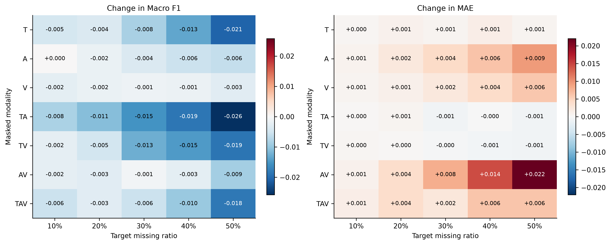
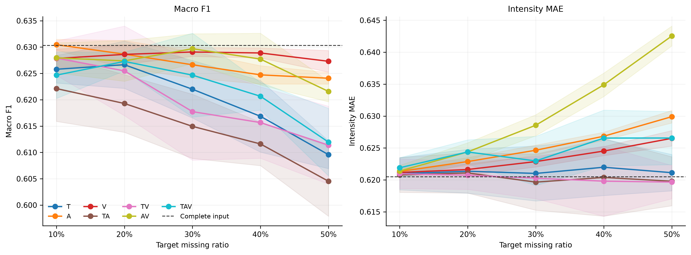
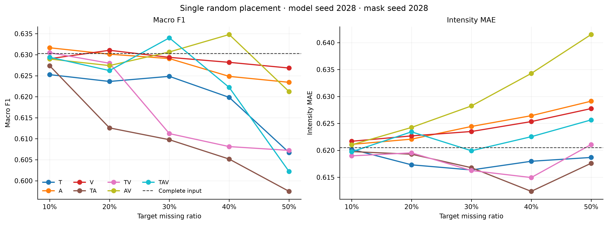
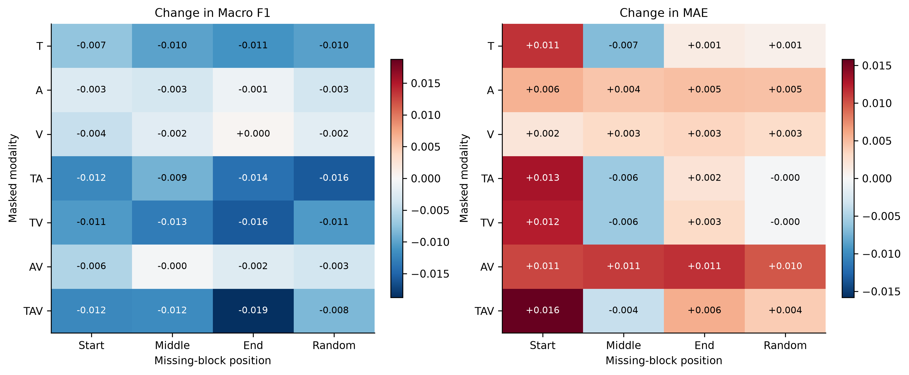
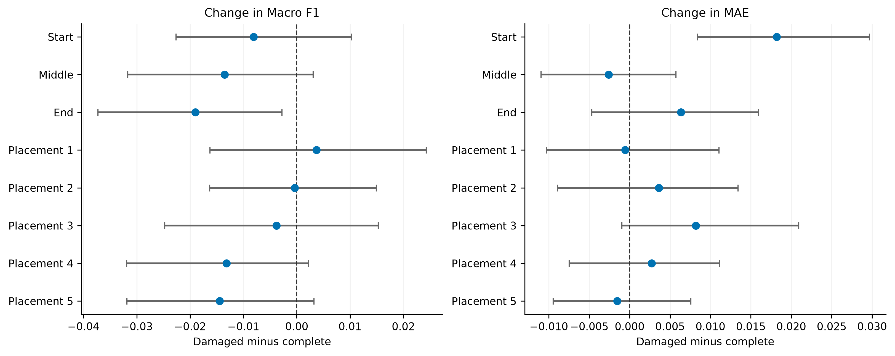
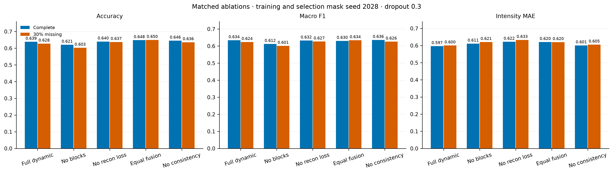

# 局部模态缺失条件下的多模态情感分类与强度预测

## 摘要

针对文本、语音和视觉信息局部缺失的情感识别问题，本文利用附件2的对齐特征训练一个同时输出三类情感及连续情感强度的模型，并对附件3的30条无标签样本作预测。预处理保留填充、自然不可用和特征质量三个不同含义的掩码。语音与视觉特征使用训练集有效位置估计标准化参数，逐维截断至正负5个标准差；全零或含非有限数值的特征行不参与统计，也不删除所在样本。模型先分别编码三种模态的时间序列，再用跨模态注意力恢复缺失位置的潜在表示，最后等权融合并进行双任务预测。训练时加入连续区间遮挡、潜在表示重建和完整输入一致性约束。本文统一采用训练随机种子2028，最终选取第9轮权重。完整输入下，训练、验证、测试集的Accuracy分别为0.7493、0.6484、0.6795，Macro F1分别为0.7265、0.6303、0.6398，强度MAE分别为0.4802、0.6205、0.6435。验证集三模态随机遮挡目标比例30%时，五个遮挡种子的平均Macro F1为0.6247，MAE为0.6230。结果说明模型对一定范围的局部缺失仍能给出预测，但Neutral识别和部分高强度样本的误差仍需关注。

**关键词：**多模态情感识别；局部模态缺失；情感强度回归；掩码建模；异常值处理

## 1 问题定义与数据

问题2包含两个输出。分类输出为Negative、Neutral和Positive，回归输出为区间$[-3,3]$内的情感强度。记样本$i$的类别与强度真值为$y_i$和$s_i$，模型分别预测$\hat y_i$和$\hat s_i$。当某一模态在局部时间区间内无法使用时，模型仍须依据剩余观测完成两项预测。

监督数据取自附件2的`aligned_50.pkl`，直接沿用其中的训练、验证和测试划分，样本数为3395、728、727。训练集Negative、Neutral、Positive的样本数为967、758、1670。每条样本最多有50个对齐位置。文本输入是附件自带的`text_bert`记号，经同一份本地冻结BERT编码为每位置768维；语音和视觉原始特征分别为74维和35维。问题1生成的多模态特征文件没有进入本题的训练输入。附件3使用对齐版本的30条样本，只有特征，没有类别或强度真值；它只用于最终推断。

读取数据时，程序核对附件2各划分中的样本ID、视频ID、类别合法性及强度范围，防止重复样本或视频跨划分泄漏。语音和视觉的标准化参数仅由训练集估计，验证集、测试集和附件3使用同一组参数。数据来源、BERT权重及预处理配置记录在[预处理清单](outputs/preprocessing_manifest.json)中。

## 2 数据预处理与异常值处理

### 2.1 内容、可用性与质量的分离

对位置$t$和模态$m$分别定义内容掩码$P_{itm}$、可用掩码$A_{itm}$、质量掩码$Q_{itm}$。实际观测状态为

$$O_{itm}=P_{itm}A_{itm}Q_{itm}.\tag{1}$$

$P=0$表示序列填充，不能作为训练内容；$A=0$表示该模态在内容位置不可用；$Q=0$表示位置存在，但提取出的特征未通过质量检查。文本掩码由BERT的attention mask确定。语音和视觉与文本内容对齐，首尾的CLS、SEP标记不作为音视频内容。对于附件3，内部文本空位按首个至最后一个有效标记界定内容范围，再保留内部空缺的不可用状态。

语音或视觉特征行必须所有维度均为有限值，且至少一个维度非零，才被视为有效。普通训练、验证和测试数据中的全零或含NaN、Inf的内容行被归入$Q=0$；附件3专门提供模态缺失样本，同样的行按其数据语义归入$A=0$。无效行在缓存中置零，并由模型的缺失表示与跨模态信息处理。程序没有因为个别行异常而删除整条样本，也没有把缺失块直接替换为训练集均值。全零规则不能辨别采集失败、特征提取失败和人为缺失的真实成因，因此上述两种数据角色的解释必须分开。

| 数据划分 | 语音有效行 | 语音无效内容行 | 视觉有效行 | 视觉无效内容行 | 视觉完全无效样本 |
| :--- | ---: | ---: | ---: | ---: | ---: |
| 训练集 | 76817 | 65 | 72633 | 4249 | 110 |
| 验证集 | 17126 | 46 | 16192 | 980 | 15 |
| 测试集 | 16855 | 0 | 15831 | 1024 | 28 |

附件3有131个语音内容位置和135个视觉内容位置被标为不可用，各涉及27条样本。这些是位置数量，不是删除的样本数。

### 2.2 极端数值的处理

对模态$m\in\{A,V\}$的每一维$d$，仅使用训练集中$O_{itm}=1$的行计算$\mu_{md}$和$\sigma_{md}$。若标准差小于$10^{-6}$，分母取1。有效行的标准化与截断为

$$\sigma^*_{md}=\begin{cases}1,&\sigma_{md}<10^{-6},\\\sigma_{md},&\text{其他情况},\end{cases}\qquad
z_{itmd}=\frac{x_{itmd}-\mu_{md}}{\sigma^*_{md}},\qquad
\widetilde x_{itmd}=\operatorname{clip}(z_{itmd},-5,5).\tag{2}$$

式（2）是逐维数值截断，不是按样本剔除。训练集共有4453个语音元素、1282个视觉元素触及截断边界，分别占有效元素约0.078%和0.050%。类别标签保持原值，强度真值不缩尾；BERT文本向量也不作这一截断。回归损失选用Smooth L1，以减小大误差样本对单步梯度的影响，但这不能替代对错误标签的人工核查。

## 3 模型构造与数据流

三种模态先经独立线性层、LayerNorm及GELU投影到128维，再叠加时间位置和模态标识向量。内容位置若未观测到原始特征，就用可训练的模态缺失向量代替原投影；填充位置在注意力中被排除。各模态分别经过两层Transformer Encoder，随后将最多$50\times3=150$个模态时间槽送入一层跨模态Transformer。跨模态表示经三个模态专属线性头生成128维重建向量。观测位置保留模态内编码，未观测位置采用重建向量。

最终模型设置为`fixed_gate`。在同一时间位置，它对所有非填充模态槽赋相等权重，故自然缺失模态可以凭借重建表示参与融合。随后用时间注意力池化得到样本级128维向量，分别交给三分类头和强度回归头。回归头输出$3\tanh(\cdot)$，将预测值限制在$[-3,3]$。模型代码中保留不确定度头和动态门控层，但`fixed_gate`前向计算使用等权权重；因此本次结果不能解释为动态置信度加权的效果。

数据的实际流向为：附件2或附件3特征与三类掩码、冻结BERT文本编码、各模态投影与缺失向量、模态内时间编码、跨模态编码、缺失表示重建、逐位置等权融合、时间注意力池化、分类与回归预测。[图1](outputs/deliverable_seed2028_all2028/charts/01_model_flow.png)与上述顺序对应。

| 模块 | 输入至输出 | 设定 |
| :--- | :--- | :--- |
| 文本编码 | `text_bert`至$50\times768$ | 本地BERT，问题2训练时冻结 |
| 模态投影 | 768、74、35维至128维 | 线性层、LayerNorm、GELU |
| 模态内时序编码 | 每模态最多$50\times128$ | 各2层Transformer，4头，前馈宽度256 |
| 跨模态编码 | 最多$150\times128$ | 1层Transformer，4头，前馈宽度256 |
| 潜在重建 | 每模态每位置128维 | 三个独立的128至128线性头 |
| 融合与池化 | 三个模态槽至128维样本向量 | 非填充槽等权，时间注意力加权 |
| 双任务输出 | 128维至3类及1个强度值 | Dropout 0.3，强度用$3\tanh$约束 |

模型实例共有1,107,529个参数，该数包含`fixed_gate`运行时不用于计算融合权重的门控相关参数。不能把总参数数目直接等同于每次前向实际参与预测的参数数目。

上述结构规定了缺失位置如何获得潜在表示。为了让重建分支在训练时见到不同长度和模态组合的缺口，还需主动构造局部遮挡，并同时约束缺失输入与完整输入的预测。

## 4 训练目标、优化与模型选择

训练时按批次从T、A、V、TA、TV、AV、TAV七种模态组合中抽样，再在0.1至0.5之间抽取目标遮挡比例，遮挡区间放在有效内容的起始、中部、末端或随机位置。遮挡仅作用于原本可观测的时间位置，文本首尾结构标记不参与。由于序列长度、四舍五入和已有自然缺失的影响，实际移除比例可与目标比例略有差异。

记类别加权交叉熵与强度Smooth L1之和为$L_{\mathrm{task}}$，下标$d$和$c$分别表示缺失输入与完整输入。本次训练目标是

$$L=L_{\mathrm{task}}^{d}+0.3L_{\mathrm{task}}^{c}+0.1L_{\mathrm{rec}}+0.1L_{\mathrm{con}}.\tag{3}$$

其中，$L_{\mathrm{rec}}$只在人工遮挡处，将缺失输入的重建向量与完整输入的投影向量比较，后者停止梯度；$L_{\mathrm{con}}$比较两种输入的类别概率和强度，完整输入分支停止梯度。类别权重由训练集频数计算为$w_c=3395/(3n_c)$。AdamW的初始学习率为$2\times10^{-4}$，权重衰减0.01，批量大小32，梯度范数上限1；第6轮开始把学习率乘0.25，得到$5\times10^{-5}$。最多训练12轮，耐心轮数为4，所有训练随机过程使用种子2028。

每轮根据验证集完整输入Macro F1和固定遮挡种子2028下的TAV目标30%缺失Macro F1选择权重，分数定义为

$$J=0.5F1_{\mathrm{valid,clean}}+0.5F1_{\mathrm{valid,TAV30}}-0.05MAE_{\mathrm{valid,TAV30}}.\tag{4}$$

第9轮的$J=0.60116$，被选为最终检查点。测试集没有用于参数更新或模型选择。图中的“训练联合损失”是式（3）的批次平均；“训练集完整输入任务损失”和“验证集完整输入任务损失”只计算各自的分类和回归任务，不含重建与一致性项，三者不应直接视为同一个量。

模型结构和训练规则确定后，先用未额外遮挡的训练、验证及测试数据建立性能基线，再以验证集基线比较不同缺失条件。

## 5 评价指标与总体结果

总体Accuracy是预测类别正确的样本比例。总体Macro F1先对三类各算$F1_c=2TP_c/(2TP_c+FP_c+FN_c)$，再取算术平均。强度MAE为$N^{-1}\sum_i|\hat s_i-s_i|$，越小越好。逐标签Accuracy与Macro F1采用该类对其余两类的一对其余二分类口径；逐标签MAE只在真值属于该类的样本上计算。逐标签Accuracy因此包含大量“正确排除其余类别”的样本，不能把它误读成该类召回率。

| 划分 | 样本数 | Accuracy | Macro F1 | 强度MAE | Pearson相关系数 |
| :--- | ---: | ---: | ---: | ---: | ---: |
| 训练集 | 3395 | 0.7493 | 0.7265 | 0.4802 | 0.8235 |
| 验证集 | 728 | 0.6484 | 0.6303 | 0.6205 | 0.6460 |
| 测试集 | 727 | 0.6795 | 0.6398 | 0.6435 | 0.6776 |

从第1轮到第12轮，训练联合损失由2.3599降至1.1112，训练集完整输入Macro F1由0.5371升至0.7568；验证集Macro F1在第9轮为0.6303，第12轮回落至0.6198。第9轮与第12轮的训练集Accuracy分别为0.7493和0.7676，验证集Accuracy分别为0.6484和0.6277。这说明后续训练继续拟合训练集，却未持续改善验证分类。Macro F1在类别决策翻转时会发生离散变化，验证集只有728条且类别比例不均；MAE则受少数强度误差较大的样本影响。再加上联合训练目标与单独的验证指标不同，逐轮震荡并不意味着代码没有收敛。第6轮降学习率后，波动没有完全消失，故采用式（4）选择检查点，而不按最后一轮交付。[图2](outputs/deliverable_seed2028_all2028/charts/02_training_curves.png)和[图2b](outputs/deliverable_seed2028_all2028/charts/02b_missing_training_curves.png)给出完整过程。

| 划分 | 类别 | 真值样本数 | 一对其余Accuracy | 一对其余Macro F1 | 类别召回率 | 类内强度MAE |
| :--- | :--- | ---: | ---: | ---: | ---: | ---: |
| 训练集 | Negative | 967 | 0.8872 | 0.8652 | 0.8490 | 0.5727 |
| 训练集 | Neutral | 758 | 0.8062 | 0.7242 | 0.5844 | 0.3630 |
| 训练集 | Positive | 1670 | 0.8053 | 0.8048 | 0.7665 | 0.4797 |
| 验证集 | Negative | 206 | 0.8077 | 0.7664 | 0.6845 | 0.7988 |
| 验证集 | Neutral | 184 | 0.7445 | 0.6665 | 0.5163 | 0.5022 |
| 验证集 | Positive | 338 | 0.7445 | 0.7421 | 0.6982 | 0.5762 |
| 测试集 | Negative | 207 | 0.8336 | 0.8015 | 0.7585 | 0.8480 |
| 测试集 | Neutral | 158 | 0.7607 | 0.6433 | 0.4304 | 0.5188 |
| 测试集 | Positive | 362 | 0.7648 | 0.7646 | 0.7431 | 0.5810 |

测试集Neutral召回率只有0.4304，158条中68条正确识别、55条误判为Positive。验证集的相应数字是95条正确、56条误判为Positive。[图5](outputs/deliverable_seed2028_all2028/charts/05_confusion_matrices.png)展示了完整混淆矩阵。验证集Negative的类内强度MAE为0.7988，测试集为0.8480，均高于同一划分的Neutral和Positive。分类薄弱类别与回归误差较大类别并不完全相同。

完整输入结果给出了判断缺失影响的参照。下一步固定第9轮权重，只改变输入中被遮挡的模态、比例和位置，从而避免把继续训练造成的差异混入缺失效应。

## 6 缺失模态规律与消融实验

最终权重固定为训练种子2028的第9轮检查点。缺失评估在验证集上穷举七种模态组合、10%至50%的五档目标比例以及起始、中部、末端、随机四种位置。固定位置和第一次随机位置使用遮挡种子2028；随机位置另重复2029至2032，共280个条件。严格只取遮挡种子2028时有140个条件。五次重复改变的是遮挡位置，始终是同一个训练后的模型，不是五次独立训练。完整输入的验证集Accuracy、Macro F1和强度MAE分别为0.6484、0.6303、0.6205，以下各项均以此为参照。

### 6.1 缺失模态类型的影响

为单独考察模态类型，先固定目标缺失率为30%，缺失位置设为随机，并对遮挡种子2028至2032的五次结果取均值。T、A、V分别代表文本、语音、视觉，字母组合表示这些模态同时被遮挡。实际缺失比例因样本长度及原有缺失而略有差异。

| 缺失模态 | 平均实际缺失率 | Accuracy | Macro F1 | 强度MAE |
| :--- | ---: | ---: | ---: | ---: |
| T | 26.9% | 0.6393 | 0.6220 | 0.6210 |
| A | 29.9% | 0.6451 | 0.6266 | 0.6246 |
| V | 29.1% | 0.6462 | 0.6291 | 0.6229 |
| TA | 28.3% | 0.6330 | 0.6149 | 0.6197 |
| TV | 28.2% | 0.6357 | 0.6177 | 0.6203 |
| AV | 29.9% | 0.6464 | 0.6297 | 0.6286 |
| TAV | 28.8% | 0.6426 | 0.6247 | 0.6230 |

与完整输入相比，单独缺失文本时Macro F1下降0.0083，单独缺失视觉时只下降0.0012。TA的F1为0.6149，是这一比例下七种组合中的最低值。AV的F1接近完整输入，但MAE升至0.6286，表明分类与强度回归对同一种缺失的反应可能不同。由于各组合的实际移除比例略有差别，这些数值是固定目标比例下的描述性比较。

*图9用颜色表示相对完整输入的Macro F1和MAE变化。本小节沿目标30%一列横向比较模态类型；F1下降和MAE上升分别对应两项任务变差，不能混用两个面板的色阶。*

### 6.2 缺失率增加时的性能变化

固定模态组合后，再沿目标缺失率由10%至50%的方向比较。下表列出五次随机位置重复均值的两端结果；20%、30%、40%的数值与标准差见[完整汇总表](outputs/deliverable_seed2028_all2028/missing_random5_summary.csv)及图8。

| 缺失模态 | 10% Macro F1 | 50% Macro F1 | 10% MAE | 50% MAE |
| :--- | ---: | ---: | ---: | ---: |
| T | 0.6258 | 0.6096 | 0.6210 | 0.6211 |
| A | 0.6305 | 0.6241 | 0.6213 | 0.6299 |
| V | 0.6278 | 0.6273 | 0.6212 | 0.6265 |
| TA | 0.6221 | 0.6045 | 0.6208 | 0.6198 |
| TV | 0.6279 | 0.6114 | 0.6210 | 0.6197 |
| AV | 0.6280 | 0.6216 | 0.6214 | 0.6425 |
| TAV | 0.6247 | 0.6120 | 0.6219 | 0.6266 |

T、TA、TV和TAV的Macro F1从10%到50%分别下降0.0162、0.0176、0.0165、0.0127；只缺视觉时从0.6278变为0.6273，变化较小。在50%随机遮挡下，含文本的四种组合平均F1为0.6094，不含文本的三种组合平均为0.6243。强度MAE的趋势不同，AV从0.6214升至0.6425，而TA在两端基本持平。图8的个别中间点还有局部回升，因此不能将所有组合概括为严格单调恶化。

*图8左、右面板分别对应Macro F1和MAE。数据点是五个遮挡种子的均值，阴影是一个标准差，水平虚线是完整输入基线。*

*图8b只使用遮挡种子2028。TAV目标30%缺失时，这一次遮挡的F1为0.6340，而图8中的五次均值为0.6247。单次结果略高于完整输入，不足以证明缺失会改善预测。*

### 6.3 缺失位置与结果波动

连续缺失发生的位置也会改变结果。对五档目标比例等权平均后，TAV在起始、中部、末端和随机位置的Macro F1分别为0.6183、0.6186、0.6116、0.6218，其中末端最低。该平均值用于比较位置敏感性，不能代替某一指定比例下的成绩。

*图10按模态组合比较起始、中部、末端及随机位置，颜色对应五个目标缺失率等权平均后的指标变化。TAV末端较低与0.6116的汇总值相对应。*

*图11将同一验证样本的缺失输入指标减去完整输入指标，点表示差值，横线表示200次配对样本Bootstrap的95%区间。Placement 1至5是五个遮挡种子，不是五次训练。图中区间跨过零，因此不宜把单次的小幅正负变化解释为稳定优势。*

模态类型、比例与位置的结果共同说明，鲁棒性不能由单一缺失率给出。下节消融固定评估口径，通过重新训练各变体检查哪些训练与结构设计有助于维持缺失输入表现。

### 6.4 同种子消融实验

消融实验保持训练种子2028、dropout 0.3、第6轮降学习率及相同划分，只改变模型或训练目标中的指定模块。表中“缺失30%”采用同一个遮挡种子2028与TAV随机位置设置，模型选择沿用式（4）。`none`表示完整的动态门控版本，`fixed_gate`表示本次交付的等权融合版本。

| 变体 | 最佳轮次 | 完整Accuracy | 完整Macro F1 | 完整MAE | TAV30% Macro F1 | TAV30% MAE | 选模分数 |
| :--- | ---: | ---: | ---: | ---: | ---: | ---: | ---: |
| 动态门控 `none` | 7 | 0.6387 | 0.6340 | 0.5967 | 0.6236 | 0.6004 | 0.59879 |
| 去连续遮挡 `no_block` | 3 | 0.6209 | 0.6122 | 0.6111 | 0.6011 | 0.6206 | 0.57561 |
| 去重建损失 `no_reconstruction` | 10 | 0.6401 | 0.6320 | 0.6221 | 0.6266 | 0.6328 | 0.59763 |
| 等权融合 `fixed_gate` | 9 | 0.6484 | 0.6303 | 0.6205 | 0.6340 | 0.6199 | 0.60116 |
| 去一致性损失 `no_consistency` | 8 | 0.6456 | 0.6357 | 0.6010 | 0.6259 | 0.6054 | 0.60057 |

去掉连续遮挡后，TAV目标30%缺失的Macro F1从最终模型的0.6340降至0.6011，是五组变体中最大的下降。去掉重建损失时，缺失输入MAE从0.6199升至0.6328。等权融合的选模分数为0.60116，在五组中最高，但仅比去一致性损失模型的0.60057高约0.00059；后者的完整输入Macro F1反而较高。每个变体只训练一次，微小差值不能解释为统计显著的结构优势。

*图14依次比较完整输入与TAV目标30%缺失输入的Accuracy、Macro F1和MAE。柱高与上表采用同一训练种子2028及学习率日程。旧交付目录中的历史消融图使用其他配置，不参与本节结论。*

### 6.5 本节结论

在附件2验证集的人工遮挡条件下，文本及其联合缺失通常伴随更明显的分类F1下降；AV高比例缺失对强度MAE的影响更突出。遮挡位置会改变估计值，单次遮挡不能替代五次位置均值。消融结果支持保留连续区间遮挡训练；等权融合按预设选模分数被选中，但结构之间的小幅差别仍需多训练种子验证。以上是带标签验证集上的描述性结论，随后使用同一最终权重对附件3的原有缺失样本进行推断。

## 7 附件3预测汇总与实例展示

前述缺失实验在有真值的验证集上人工遮挡特征，用于衡量已知条件下的性能变化。附件3则包含真实给出的模态缺失样本，可以检验同一权重能否完成实际推断。两部分使用相同的预处理统计量和模型参数，但附件3没有类别或强度真值，因而只能报告预测，不能延用验证集的性能指标。

最终权重对附件3的30条样本预测Negative 6条、Neutral 8条、Positive 16条；预测强度均值为0.4080。27条样本存在音视频不可用位置，3条未检测到此类缺失；按文件记录的逐样本缺失比例取平均为13.4%。[图12](outputs/deliverable_seed2028_all2028/charts/12_attachment3_predictions.png)展示全部样本的三类概率、预测强度与缺失比例，[图13](outputs/deliverable_seed2028_all2028/charts/13_attachment3_distribution.png)汇总预测分布。正文选取下列六条样本，分别体现完整输入、低区分度输出、类别与强度不一致、较高正向强度以及较高缺失比例等情况。概率是未经校准的softmax输出。

| 样本 | 预测类别 | 预测强度 | P(Negative) | P(Neutral) | P(Positive) | 缺失类型 | 缺失比例 |
| :--- | :--- | ---: | ---: | ---: | ---: | :--- | ---: |
| 附件3_01 | Negative | -0.593615 | 0.865553 | 0.105388 | 0.029059 | 无 | 0.0% |
| 附件3_08 | Negative | 0.080391 | 0.357866 | 0.309993 | 0.332140 | AV | 8.5% |
| 附件3_14 | Negative | 0.073218 | 0.621772 | 0.235019 | 0.143209 | AV | 5.6% |
| 附件3_16 | Positive | 1.687375 | 0.008613 | 0.033877 | 0.957510 | AV | 7.7% |
| 附件3_17 | Neutral | -0.312780 | 0.234189 | 0.592048 | 0.173763 | AV | 23.5% |
| 附件3_30 | Neutral | 0.459217 | 0.049755 | 0.726137 | 0.224108 | AV | 32.4% |

附件3_08的三类概率接近，最高的Negative概率仅为0.3579，不能将这一类别视为有充分把握的判断。附件3_14虽被分为Negative，预测强度却略大于零；分类头与回归头分别优化，二者并无强制符号一致约束。附件3_30的音视频缺失比例较高，模型仍输出Neutral及0.4592的强度，但缺少真值，无法评定该结果是否正确。上述实例只用于解释输出形式，不代表全部30条样本的准确情况。所有样本的原始数值见[附件3全量预测表](outputs/deliverable_seed2028_all2028/attachment3_predictions.csv)。

附件3无法承担误差评价。因此，下一节回到有标签的验证集，利用混淆矩阵、强度散点及数据质量切片，分析模型在可核验样本上的具体错误。

## 8 验证集基础性能、可视化与错误归因

验证集完整输入的Accuracy、Macro F1、强度MAE及Pearson相关系数分别为0.6484、0.6303、0.6205、0.6460。500次样本Bootstrap的95%区间依次为[0.6126,0.6799]、[0.5931,0.6641]、[0.5841,0.6582]和[0.5975,0.6979]。总体指标见[图3](outputs/deliverable_seed2028_all2028/charts/03_split_metrics.png)，逐标签指标见[图4](outputs/deliverable_seed2028_all2028/charts/04_label_metrics.png)，类别混淆见[图5](outputs/deliverable_seed2028_all2028/charts/05_confusion_matrices.png)，强度散点见[图6](outputs/deliverable_seed2028_all2028/charts/06_regression_scatter.png)。

验证集按文本长度分组时，长度不超过10、11至30、超过30个内容位置的样本数分别为83、459、186，Macro F1分别为0.6398、0.6260、0.6280。按视觉质量分组时，视觉完全无效、部分无效和全部有效的样本数为15、70、643，Macro F1分别为0.6390、0.5590、0.6367。第二组表现较低，但组别的类别构成及文本内容可能不同；这组切片不能证明视觉质量下降是唯一原因。强度散点图中存在类别反向且误差较大的样本，例如验证样本`f_ZJ7L14oYQ$_$21`真实强度为2.0000，预测为负1.6678。它提醒我们检查异常预测，但单个案例不能代表全部误差机制。

测试集总体Accuracy为0.6795、Macro F1为0.6398、MAE为0.6435。验证集与测试集的抽样区间是针对固定模型的样本Bootstrap，并非重新训练的不确定性。当前消融仅有一个训练种子，缺失实验的五个遮挡种子也只检验位置扰动。若进一步声称方法能适用于其他数据来源，还需要外部带标签、缺失机制已知的数据进行独立检验。

## 9 图像解读与结论

本次论文使用的16张主图均在[种子2028最终图表目录](outputs/deliverable_seed2028_all2028/图表目录.md)中，并已在[逐图解读附录](问题2_随机种子2028_全部图像解读.md)逐张解释。附录清点了原有73个PNG文件；按文件哈希合并后是46种不同画面，其中一些是早期配置、旧版遮挡实验或完全相同的副本。16张主图及1张鲁棒性补图另有[SVG、PDF矢量图目录](outputs/problem2_seed2028_vector_figures/矢量图目录.md)、[逐图放置说明](outputs/problem2_seed2028_vector_figures/每张图放置说明.md)与[17页合订PDF](outputs/problem2_seed2028_vector_figures/问题2_随机种子2028_全部17张矢量图.pdf)。正文结论只采用`outputs/deliverable_seed2028_all2028`的结果；图中的紫色竖线表示第6轮开始降低学习率，绿色竖线表示第9轮被选中，并非额外实验组。

本题的主要做法是保留自然缺失与数值异常的位置语义，用训练集统计量规范化有效音视频特征，在训练中模拟连续块缺失，再以跨模态潜在重建和双任务学习完成预测。随机种子2028的结果表明，目标50%文本相关缺失对分类的影响通常大于单独缺失语音或视觉，Neutral的召回率仍是分类短板。附件3的预测只能作为待核验结果，不能用其无真值数据给出性能结论。

## 复现依据

预处理实现见[data.py](data.py)、[掩码代码](vendor/mmer_preprocess/masks.py)和[标准化代码](vendor/mmer_preprocess/stats.py)；模型与训练实现分别见[model.py](model.py)和[experiment.py](experiment.py)。逐轮指标、逐标签指标、缺失条件表和同种子消融表依次见[逐轮数据](outputs/deliverable_seed2028_all2028/seed2028_epoch_metrics.csv)、[标签指标](outputs/deliverable_seed2028_all2028/label_metrics.csv)、[缺失实验](outputs/deliverable_seed2028_all2028/valid_robustness.csv)和[消融数据](outputs/deliverable_seed2028_all2028/ablation_summary_seed2028.csv)。最终检查点、附件3结果与所有主图均收录在[交付目录](outputs/deliverable_seed2028_all2028)。
